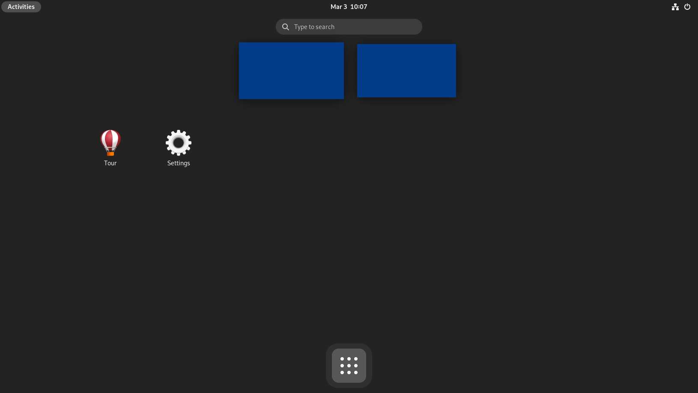
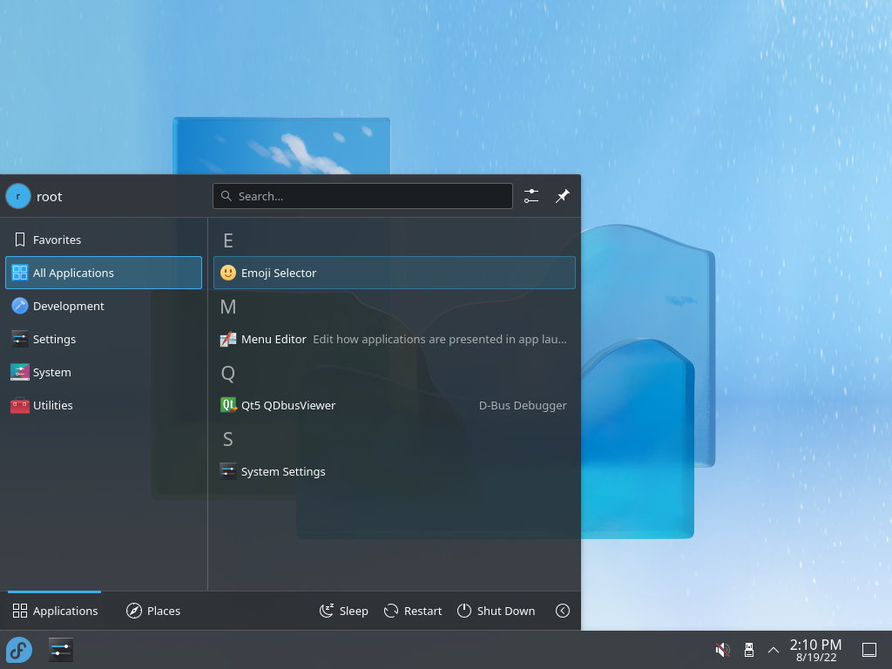

# Minimal Fedora Desktop Environment

How to install a desktop environment without any software on Fedora.

## Prerequisites

I work with a minimal installation of Fedora 37:

```
From Fedora-Server-netinst-x86_64-37-1.7.iso
SHA-256 = 149D4BAE999022B07BD40F8272F6208BC28884DAD5110C63E915D37458E6ABC0
During the installation, choose Minimal and untick everything, if necessary.
```

All the commands are executed as root.

## Minimal GNOME Shell



### Manual installation

Please read https://github.com/locobastos/MinimalFedoraDesktopEnvironment/blob/master/minimal-gnome-installation/README.md

### Automatic installation

```
curl -L https://raw.githubusercontent.com/locobastos/MinimalLinuxDesktopEnvironment/master/minimal-gnome-installation/minimal-gnome-installation.sh | /bin/bash
```

## Minimal Plasma Desktop



### Manual installation

Please read https://github.com/locobastos/MinimalFedoraDesktopEnvironment/blob/master/minimal-plasma-installation/README.md

### Automatic installation

```
curl -L https://raw.githubusercontent.com/locobastos/MinimalLinuxDesktopEnvironment/master/minimal-plasma-installation/minimal-plasma-installation.sh | /bin/bash
```
