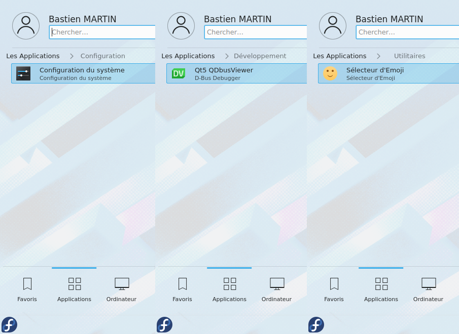

# Minimal Fedora Desktop Environment
How to install a desktop environment without any software on Fedora.

## Prerequisites
I work with a minimal installation of Fedora 32:
```
From Fedora-Server-netinst-x86_64-32-1.6.iso
SHA-256 = 7F4AFD2A26C718F9F15E4BBFD9C2E8849F81036D2A82A4E81FA4A313A833DA9C
During the installation, choose Minimal and untick everything, if necessary.
```
All the commands are executed as root.

## Minimal GNOME Shell


### Manual installation

#### Update your OS
```
dnf upgrade -y
```

#### Install the display server (X.Org) + GNOME Shell
```
dnf install -y xorg-x11-utils xdg-user-dirs gnome-shell
```

#### Enable GNOME on boot
```
systemctl enable gdm graphical.target
systemctl set-default graphical.target
```

### Automatic installation
```
curl -L https://raw.githubusercontent.com/locobastos/MinimalLinuxDesktopEnvironment/master/minimal-gnome-installation/minimal-gnome-installation.sh | /bin/bash
```

## Minimal Plasma Desktop




### Manual installation

#### Update your OS
```
dnf upgrade -y
```

#### Install the display server (X.Org) + Plasma Desktop
```
dnf install -y xorg-x11-utils xdg-user-dirs plasma-desktop sddm sddm-kcm
```

#### Enable Plasma on boot
```
systemctl enable sddm graphical.target
systemctl set-default graphical.target
```

### Automatic installation
```
curl -L https://raw.githubusercontent.com/locobastos/MinimalLinuxDesktopEnvironment/master/minimal-plasma-installation/minimal-plasma-installation.sh | /bin/bash
```