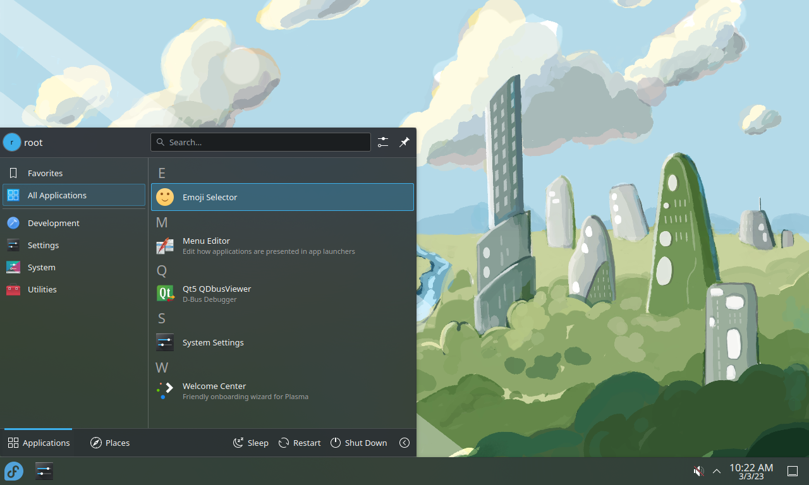

# Minimal Fedora Desktop Environment

How to install a desktop environment without any software on Fedora.

## Prerequisites

I work with a minimal installation of Fedora 32:

```
From Fedora-Server-netinst-x86_64-32-1.6.iso
SHA-256 = 421C4C6E23D72E4669A55E7710562287ECD9308B3D314329960F586B89CCCA19
During the installation, choose Minimal and untick everything, if necessary.
```

All the commands are executed as root.

## Minimal GNOME Shell


### Manual installation

Please read https://github.com/locobastos/MinimalFedoraDesktopEnvironment/blob/master/minimal-gnome-installation/README.md

### Automatic installation

```
curl -L https://raw.githubusercontent.com/locobastos/MinimalLinuxDesktopEnvironment/master/minimal-gnome-installation/minimal-gnome-installation.sh | /bin/bash
```

## Minimal Plasma Desktop



### Manual installation

Please read https://github.com/locobastos/MinimalFedoraDesktopEnvironment/blob/master/minimal-plasma-installation/README.md

### Automatic installation

```
curl -L https://raw.githubusercontent.com/locobastos/MinimalLinuxDesktopEnvironment/master/minimal-plasma-installation/minimal-plasma-installation.sh | /bin/bash
```
